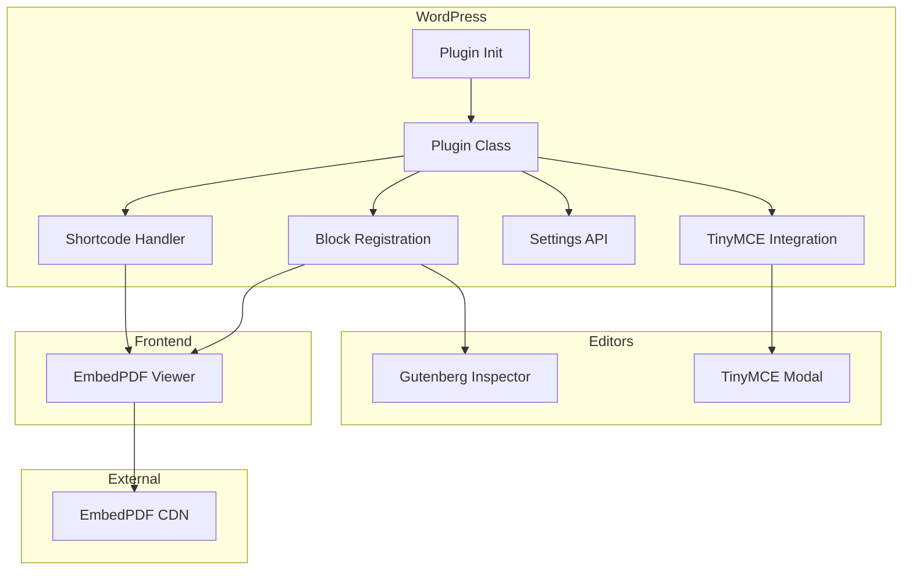

# Advanced PDF Embedder

[](https://wordpress.org/)
[](https://www.gnu.org/licenses/agpl-3.0.html)
[](https://php.net/)

A modern, feature-rich WordPress plugin for embedding PDF documents with a beautiful viewer powered by [EmbedPDF](https://embedpdf.com/). Supports both the Classic Editor (TinyMCE) and the Block Editor (Gutenberg).


---

## Features

- **Beautiful PDF Viewer** - Powered by EmbedPDF 2.0 for a modern viewing experience
- **Light & Dark Themes** - Choose the theme that matches your site
- **Multi-language Support** - English, French, German, Spanish, and Dutch
- **Responsive Design** - Works perfectly on desktop and mobile
- **Highly Configurable** - Control toolbar, sidebar, download, print, annotations, and zoom
- **Dual Editor Support** - Works with both Classic Editor and Gutenberg
- **Global Defaults** - Set default options that apply to all new embeds
- **Easy Integration** - Use shortcodes or blocks to embed PDFs

---

## Installation

### From GitHub

1. Download the latest release from [GitHub Releases](https://github.com/guilamu/advanced-pdf-embedder/releases)
2. Go to **WordPress Admin → Plugins → Add New → Upload Plugin**
3. Upload the downloaded ZIP file
4. Click **Install Now** and then **Activate**

### Manual Installation

1. Clone this repository:
   ```bash
   git clone https://github.com/guilamu/advanced-pdf-embedder.git
   ```
2. Copy the `advanced-pdf-embedder` folder to `/wp-content/plugins/`
3. Activate the plugin in **WordPress Admin → Plugins**

---

## Quick Start

### Using the Block Editor (Gutenberg)

1. Create or edit a post/page
2. Click the **+** button to add a new block
3. Search for **"Advanced PDF Embedder"**
4. Configure your PDF settings in the block inspector panel
5. Select a PDF from your Media Library

### Using the Classic Editor (TinyMCE)

1. Create or edit a post/page in Classic Editor
2. Click the **PDF** button in the toolbar
3. Click **"Browse Media Library"** to select your PDF
4. Configure the viewer options
5. Click **"Insert PDF"**

### Using Shortcodes

```
[embedpdf url="https://example.com/document.pdf" width="100%" height="600px"]
```

#### Shortcode Attributes

| Attribute | Type | Default | Description |
|-----------|------|---------|-------------|
| `url` | string | *required* | Full URL to the PDF file |
| `width` | string | `100%` | Width of the viewer (px, %, em, vh, vw) |
| `height` | string | `600px` | Height of the viewer |
| `theme` | string | `light` | Theme: `light` or `dark` |
| `language` | string | `en` | Language: `en`, `fr`, `de`, `es`, `nl` |
| `toolbar` | boolean | `true` | Show/hide the toolbar |
| `sidebar` | boolean | `true` | Show/hide the sidebar |
| `download` | boolean | `true` | Allow PDF download |
| `print` | boolean | `true` | Allow PDF printing |
| `annotations` | boolean | `true` | Enable annotation tools |
| `redact` | boolean | `true` | Enable redaction tools |
| `zoom` | boolean | `true` | Enable zoom controls |

#### Example with All Options

```
[embedpdf 
  url="https://example.com/document.pdf" 
  width="100%" 
  height="800px" 
  theme="dark" 
  language="fr" 
  toolbar="true" 
  sidebar="false" 
  download="true" 
  print="false" 
  annotations="true" 
  redact="false" 
  zoom="true"
]
```

---

## Configuration

### Global Settings

Navigate to **Settings → Advanced PDF Embedder** to configure default options:

- **Dimensions** - Default width and height for new embeds
- **Theme** - Default color theme (Light/Dark)
- **Language** - Default viewer language
- **Features** - Enable/disable toolbar, sidebar, download, print, annotations, redaction, and zoom

These defaults are applied when inserting a new PDF via the TinyMCE button or Gutenberg block.

---

## Project Structure

```
advanced-pdf-embedder/
├── advanced-pdf-embedder.php    # Main plugin file (activation, constants, init)
├── uninstall.php                # Cleanup on plugin deletion
│
├── includes/
│   └── class-advanced-pdf-embedder.php   # Core plugin class
│       ├── Shortcode rendering
│       ├── Block registration & rendering
│       ├── Settings page & API
│       ├── TinyMCE integration
│       └── Script/style enqueuing
│
├── assets/
│   └── editor-button.js         # TinyMCE modal & button (modern UI)
│
├── blocks/
│   └── embed-pdf/
│       ├── block.json           # Block metadata & attributes
│       ├── index.js             # Gutenberg block editor component
│       └── style.css            # Block frontend styles
│
└── languages/
    ├── advanced-pdf-embedder.pot           # Translation template
    ├── advanced-pdf-embedder-en_US.po      # English strings
    ├── advanced-pdf-embedder-fr_FR.po      # French translation
    ├── advanced-pdf-embedder-fr_FR.mo      # Compiled French
    └── *.json                              # Block editor translations
```

---

## Architecture

### Core Components



### Data Flow

1. **Settings** → Saved in `wp_options` as `advanced_pdf_embedder_defaults`
2. **Shortcode/Block** → Parsed and merged with defaults
3. **Renderer** → Outputs container div + initialization script
4. **EmbedPDF** → Loaded from CDN, initializes viewer in container

---

## Internationalization

The plugin is fully translatable with support for:

| Language | Code | Status |
|----------|------|--------|
| English | `en_US` | Complete |
| French | `fr_FR` | Complete |
| German | `de_DE` | Template ready |
| Spanish | `es_ES` | Template ready |
| Dutch | `nl_NL` | Template ready |

### Adding Translations

1. Copy `languages/advanced-pdf-embedder.pot` to `languages/advanced-pdf-embedder-{locale}.po`
2. Translate strings using [Poedit](https://poedit.net/) or similar
3. Compile to `.mo` file
4. For Gutenberg, create JSON translations using `wp i18n make-json`

---

## Development

### Requirements

- WordPress 6.0+
- PHP 7.4+
- Modern browser with JavaScript enabled

### Local Development

```bash
# Clone the repository
git clone https://github.com/guilamu/advanced-pdf-embedder.git

# Navigate to your WordPress plugins directory
cd /path/to/wordpress/wp-content/plugins/

# Create symlink (optional)
ln -s /path/to/advanced-pdf-embedder advanced-pdf-embedder
```

### Coding Standards

This plugin follows [WordPress Coding Standards](https://developer.wordpress.org/coding-standards/):

- PHP: WordPress PHP Coding Standards
- JavaScript: WordPress JavaScript Coding Standards
- CSS: WordPress CSS Coding Standards

---

## Hooks & Filters

### Available Filters

```php
// Modify shortcode defaults
add_filter('advanced_pdf_embedder_shortcode_defaults', function($defaults) {
    $defaults['theme'] = 'dark';
    return $defaults;
});

// Modify EmbedPDF config before rendering
add_filter('advanced_pdf_embedder_config', function($config, $atts) {
    // Add custom configuration
    return $config;
}, 10, 2);
```

---

## Changelog

### 1.1.0 (2025-12-29)

- **GitHub Auto-Update** - Plugin now supports automatic updates from GitHub releases
- Updated plugin author to Guilamu
- Updated Plugin URI to official GitHub repository

### 1.0.0 (2024-12-20)

- Initial release
- Shortcode support with all EmbedPDF options
- Gutenberg block with visual editor
- TinyMCE button with modern modal UI
- Global settings page
- Multi-language support (EN, FR)
- Light and dark themes
- ES Module support for EmbedPDF 2.0

---

## Contributing

Contributions are welcome! Please feel free to submit a Pull Request.

1. Fork the repository
2. Create your feature branch (`git checkout -b feature/amazing-feature`)
3. Commit your changes (`git commit -m 'Add some amazing feature'`)
4. Push to the branch (`git push origin feature/amazing-feature`)
5. Open a Pull Request

---

## License

This project is licensed under the AGPL v3 – see the [LICENSE](LICENSE) file for details.

---

## Acknowledgments

This plugin would not be possible without the incredible work of the **EmbedPDF** team.

### Special Thanks to [EmbedPDF](https://github.com/embedpdf/embed-pdf-viewer)

We extend our sincere gratitude to the [**embed-pdf-viewer**](https://github.com/embedpdf/embed-pdf-viewer) project and all its contributors for creating and maintaining an outstanding, modern PDF viewing solution.

**What EmbedPDF provides:**
- A fast, lightweight PDF viewer built for the modern web
- Beautiful, customizable UI with light and dark themes
- Multi-language internationalization support
- Rich feature set including annotations, redaction, and zoom controls
- Easy-to-use ES Module architecture
- Excellent documentation and developer experience

This WordPress plugin serves as a wrapper to bring EmbedPDF's powerful capabilities to the WordPress ecosystem, making it accessible to millions of WordPress users worldwide.

> **If you find this plugin useful, please also consider:**
> - Starring the [EmbedPDF repository](https://github.com/embedpdf/embed-pdf-viewer)
> - Sharing EmbedPDF with other developers
> - Contributing to the EmbedPDF project

### Other Credits

- [WordPress](https://wordpress.org/) - The world's most popular content management platform
- [Dashicons](https://developer.wordpress.org/resource/dashicons/) - WordPress icon font
- The WordPress community for inspiration and feedback

---

## Support

- **Bug Reports**: [GitHub Issues](https://github.com/guilamu/advanced-pdf-embedder/issues)
- **Feature Requests**: [GitHub Issues](https://github.com/guilamu/advanced-pdf-embedder/issues)

---

<p align="center">
  Made with love for the WordPress community
</p>
